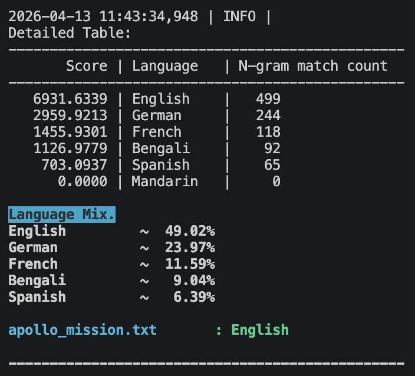
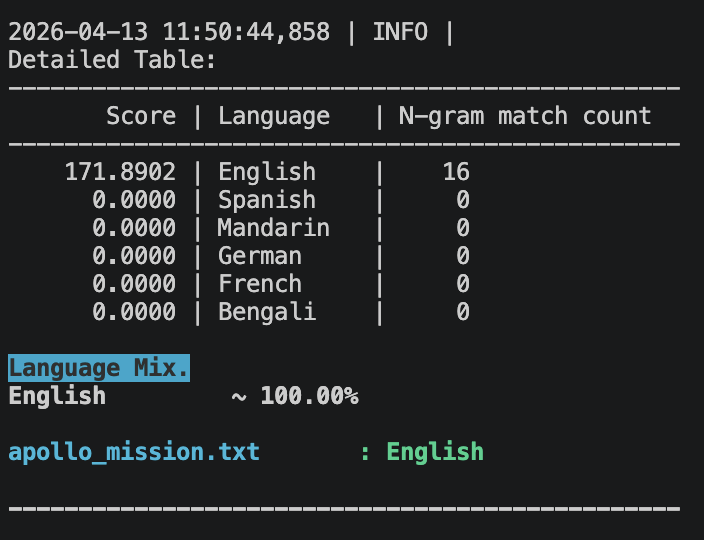

# Contents
1. [About](#about)
2. [Project structure](#project-structure)
3. [How to run the code](#how-to-run-the-code)
4. [Adding a new language](#adding-a-new-language) 
5. [Code Analysis](#code-analysis)
6. [Challenges](#challenges)

## About 
This project is used to perform automatic language detection in a document. Note that, detecting the language of a document is not the same as detecting the script because multiple languages can share the same script (e.g., Spanish and Portuguese, or Hindi and Marathi).

We can represent this task as a conditional probability.
$p(E_0|w_0 w_1... w_N) = \frac{p(E_0) \cdot p(w_0 w_1... w_N|E_0)}{p(w_0 w_1... w_N)}$ ...(1)

where, $E_0$ ~ is a particular language and $w_0 w_1... w_N$ ~ represents words in a text.

If we divide the above equation with the equation of another language $E_1$, we get the following.
$\frac{p(E_0|w_0 w_1... w_N)}{p(E_1|w_0 w_1... w_N)} = \frac{p(w_0 w_1... w_N|E_0)}{p(w_0 w_1... w_N|E_1)}$ ...(2)

Provided we assume that $p(E_0) = p(E_1),$ i.e., the probability (or expectation) of obtaining documents from different languages is equal. Alternatively, we can estimate $p(E_0) = \frac{\text{People who speak language }E_0}{\text{Total people}}.$
This serves as a proxy for the fraction of documents in language $E_0$. Under this assumption, the likelihood that our model encounters a document in a given language is proportional to the number of people worldwide who speak that language. But for simplicity we assume the prior probabilities are equal.

For **uni-gram models**, Equation(2) can be simplified to Equation(3) below, because every token is assumed to be independent.
$\frac{p(E_0|w_0 w_1... w_N)}{p(E_1|w_0 w_1... w_N)} = \frac{\prod\limits_{i=0}^{N}p(w_{i}|E_0)}{\prod\limits_{i=0}^{N}p(w_{i}|E_1)}$... (3)

To calculate the probability of a token $w_j$ appearing in a text written in language  $E_0$ is given by the following formula, which is also known as `laplace smoothing`.

$p(w_j|E_0)=\frac{f_j + \alpha}{N_0 + \alpha \cdot c}$... (4)

where, $\alpha$ is typically set as 1.0, its used to prevent the entire probability from going to zero, c is the total number of classes, which is the same as total number of languages in our case, $N_0$ is the vocabulary size and $f_j$ is frequency of the term $w_j$ appearing in the text. 

A more generic form of Equation(3) is shown below, we call the equation the score of language $E_i$, where

$Score(E_i) = \frac{\prod\limits_{i=0}^{N}p(w_{i}|E_i)}{\prod\limits_{i=0}^{N}p(w_{i}|E_{ref})}$... (5) 

$E_{ref} = argmin_{E_j} \prod\limits_{i=0}^{N}p(w_{i}|E_{j})$... (6)

For **bi-gram models**, Equation(5) changes to Equation(6). This pattern continues for other higher n-gram models.
$$Score(E_i) = \frac{\prod\limits_{i=0}^{N-1}p(w_{i}w_{i+1}|E_i)}{\prod\limits_{i=0}^{N-1}p(w_{i}w_{i+1}|E_{ref})}\tag{6}$$

## Project structure
- **train-data/** — Language-specific corpus for training models.
- **test-data/** — Sample documents for testing language identification.
- **model/** — Contains trained language models (1-gram, 2-gram... models).
- **main.py** — Primary script to run train or test modes, this is the main entry point of the code.
- **commons.py** — Shared utilities and helper functions b/w files naive_test.py and naive_train.py
- **naive_trian.py** — Contains code to load, train and save n-gram models.
- **naive_test.py** — Contains code to load models and do inference.
- **pyproject.toml** — Project configuration and dependencies.

## How to run the code

### 1. Activate the environment
```bash
uv sync
source .venv/bin/activate
```

### 2. Run the code

To explore all the options/modes, the following command can be used. 
```python
python3 main.py --help
```

There are two modes to run this code:
1. **train mode** — Trains the model using the corpus stored in train-data folder.
2. **test mode** — Uses the trained model for inference.

In train mode, you can run the code in two ways. By activating the `--clean` option, in which the model is trained from scratch. Without this flag, the model only trains on the newly added documents, incrementally. And, in test mode, the trained model is used to identify languages in a document.

Some examples of the different modes in which the code can be run are shown below.
```python
    Example 1:(Clean training of ngram 2 model)
    python3 main.py --mode train --clean --ngram 2 --log-level INFO
    
    Example 2:(For incremental training when a new file is added for an existing model)
    python3 main.py --mode train --ngram 2 --log-level INFO
    
    Example 3:(For more information about a run)
    python3 main.py --mode test --ngram 2 --log-level INFO

    Example 4:(Predict language of a specific file)
    python3 main.py --mode test --ngram 2 --filepath train-data/de/book1.txt
```
As shown in the above examples, for any run --ngram flag is required and it indicates what type of n-gram models to train or use to do the inference. 
Currently, the code can process only two types of file extensions **.pdf** and **.txt**.

## Adding a new language
Broadly speaking, there are about **7,168 living languages** in the world. However, linguistic diversity is highly skewed, which is illustrated by the table below which shows total speakers by different languages.

| Rank | Language           | Total Speakers | Primary Script                  |
|------|------------------|---------------|--------------------------------|
| 1    | English           | 1.5 Billion   | Latin                          |
| 2    | Mandarin Chinese  | 1.2 Billion   | Han (Simplified/Traditional)   |
| 3    | Hindi             | 629 Million   | Devanagari                     |
| 4    | Spanish           | 590 Million   | Latin                          |
| 5    | French            | 416 Million   | Latin                          |
| 6    | Modern Arabic     | 335 Million   | Arabic                         |
| 7    | Portuguese        | 282 Million   | Latin                          |
| 8    | Bengali           | 278 Million   | Bengali–Assamese               |

Therefore for simplicity, we consider the following popular languages **English, German, French, Spanish, Mandarin, Bengali** for this project and make it easy to onboard a new language.
The steps below show how to add a new language to our project.
1. Add an entry for the new language to `folder_to_label.json`. For example, if we want to add Korean we add `kr: Korean`, where kr is the shorthand for the language, one can choose any shorthand for a language.
2. Add the **korean language corpus** to **kr** folder inside **train-data**. 
3. Run `python3 main.py --mode train --ngram 2 --log-level INFO` to create a bi-gram model for the Korean language.

## Code Analysis

Language detection using **n-gram models** involves trade-offs between accuracy and memory usage.

**`Uni-gram Models (n-gram = 1)`** consider individual words independently. While they are **memory-efficient**, it's **less accurate**, especially for closely related languages.
- Similar languages (e.g., English and German) may share common words, this leads to **overlapping predictions** and noisy language distributions.
- Uni-grams also struggle to distinguish, truly **multilingual documents** from **single-language documents** with incidental overlap

**Example Output:**



**Observations:**  
Although the document is correctly classified as English, a significant portion is attributed to German and other languages. This is likely due to shared vocabulary, numeric tokens and noisy training data where language of one type is present in the document of another language type.

**`Tri-gram Models (n-gram = 3)`** consider sequences of three words, capturing **context and structure**.
- Much **higher accuracy**  
- Reduced ambiguity between similar languages

**Example Output:**



**Observations:**  
For tri-gram models, in the worst case scenario we'll have $N^3$ memory usage where $N$ is the size of the vocabulary. If $N$ is one million the model cannot be stored in normal RAM. To limit the excessive memory usage, most frequent tri-grams must be stored. Moving past tri-grams would mean the number of matches in the test document will decrease which is especially a problem for short texts/tweets.

**Improvements:** For each language we quickly built a corpus by downloading two free books from **Project Gutenberg**, the books might not have one pure language, there could be noisy data like wrong phrases and spellings. It's possible to build a better training corpus. 

## Challenges
1. **Multilingual Documents**  
   A single document may contain multiple languages, making it necessary to detect and represent languages in a **percentage-based distribution** rather than assigning a single label.

2. **Scalability Across Languages**  
   With thousands of languages worldwide, we could only focus on a subset of **high-resource / widely spoken languages**. 

3. **Tokenization Differences Across Languages**  
   Languages like English, French, or German use **whitespace-delimited words**, making tokenization straightforward. In contrast, languages such as Chinese do not use spaces between words, which complicates tokenization. For simplicity, the current approach handles languages like Chinese by building a **unigram model** based on **unicode character ranges**.
